<h1 align="center">OBR Artística 2026 · Batalha de Robôs</h1>

<p align="center"><strong>Cinemática, interação com o público e combate entre DinoByte e PenLinux no telão da etapa regional</strong></p>

<p align="center">
  
  
  
  
  
</p>

<p align="center">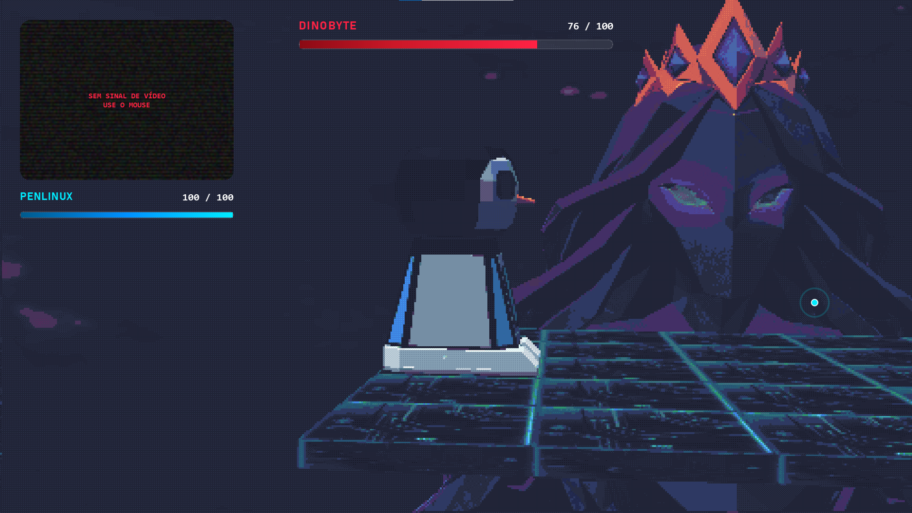</p>

Sistema integrado ao **telão da OBR Artística 2026**, na etapa regional. A apresentação começa com uma cinemática, envolve o público na escolha entre **DinoByte** e **PenLinux** e conduz uma batalha de robôs com arena 3D, minijogos por visão computacional e comandos para os robôs físicos. Este repositório reúne o código, os recursos da apresentação e os registros visuais do projeto.

## Da cinemática à batalha

1. A câmera inicia a calibração da mão.
2. A cinemática de abertura apresenta a história; um roteiro de comandos robóticos pode rodar em paralelo.
3. O público escolhe **DinoByte** ou **PenLinux**.
4. Uma sequência assíncrona movimenta o robô selecionado.
5. O vídeo seguinte inicia o jogo 3D em outro processo.
6. Após o combate, a apresentação retorna ao ato final.

A ordem, os tempos e os tipos de slide ficam em [`sequence.json`](sequence.json). O fluxo usa `asyncio` para coordenar a apresentação, e o jogo combina PySide6 com Panda3D.

## Galeria da apresentação

| Escolha entre DinoByte e PenLinux |
| --- |
| 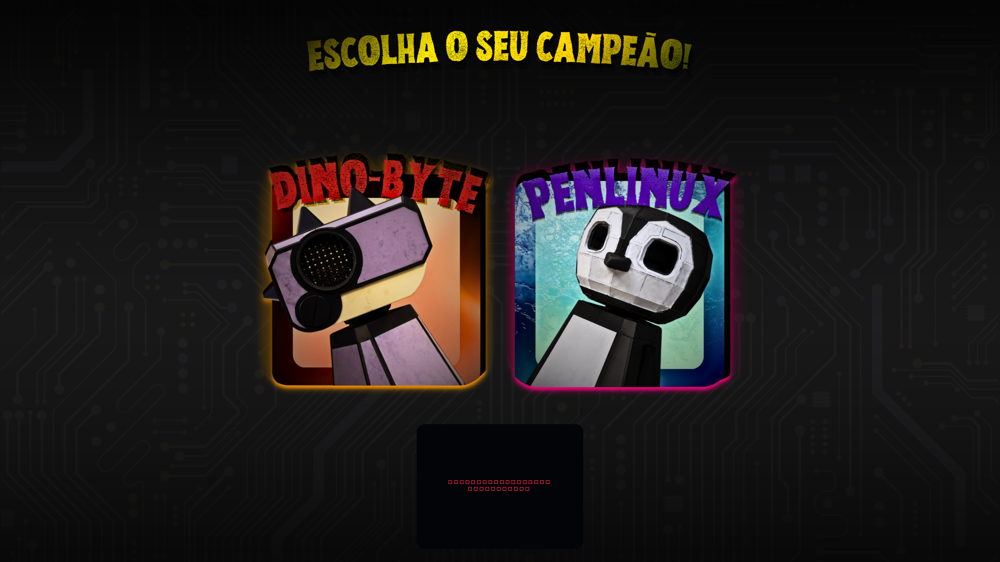 |

| Calibração por gesto | Apresentação do PenLinux |
| --- | --- |
| 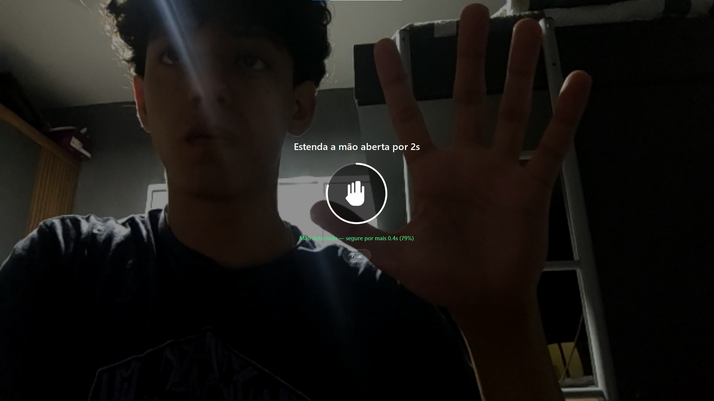 | 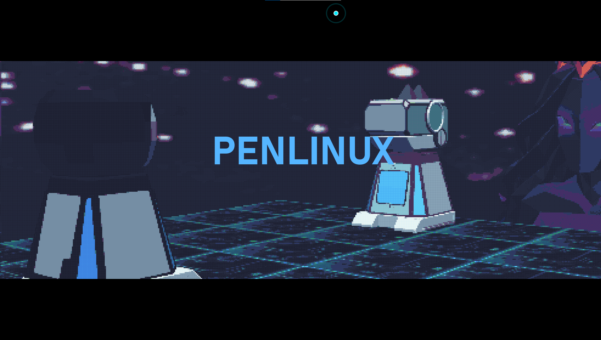 |

| Arena: vista frontal | Arena: vista diagonal |
| --- | --- |
|  | 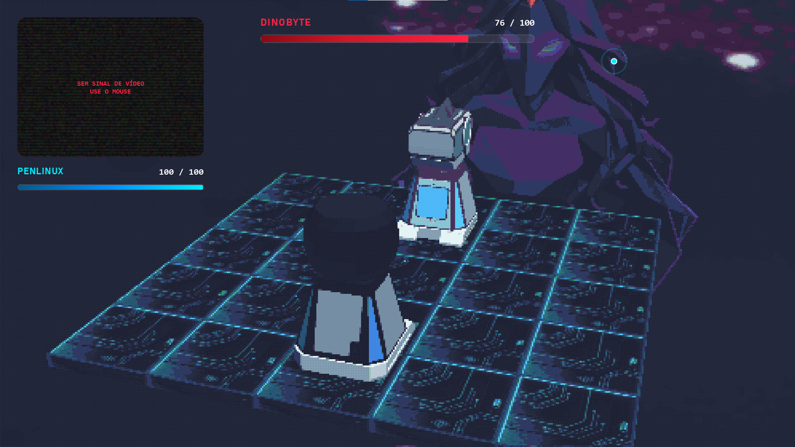 |

As novas capturas da apresentação e da seleção estão em [`docs/screenshots/`](docs/screenshots/). A cena da cinemática anterior permanece no acervo do projeto.

## Minijogos

O combate inclui seis ataques interativos e um desafio de desvio. As imagens abaixo foram geradas pelas **interfaces reais do projeto**, em modo Qt `offscreen`, sem webcam, arena 3D ou ESP32. São prévias técnicas das telas, não registros de uma partida completa. [Como reproduzir as capturas](docs/MINIGAMES.md).

| DinoByte: Mordida Jurássica | DinoByte: Sucção Jurássica |
| --- | --- |
| 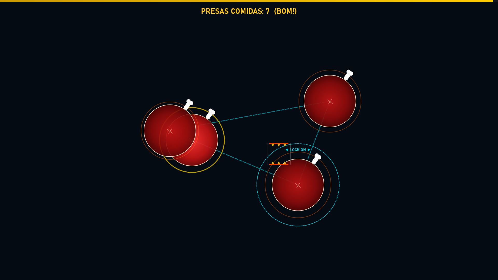 | 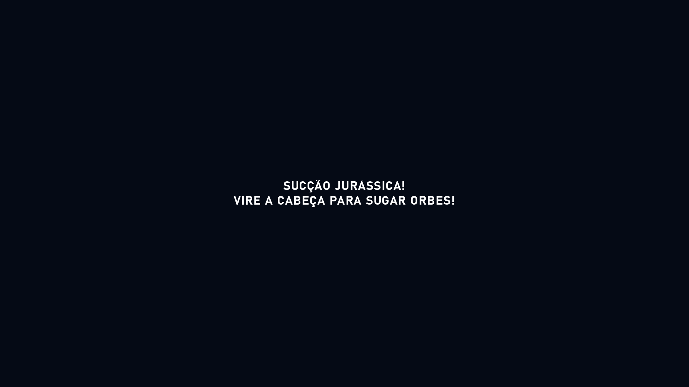 |

| DinoByte: Meteor Stomp | PenLinux: Dance Night |
| --- | --- |
| 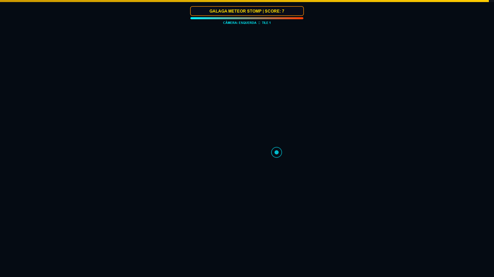 | 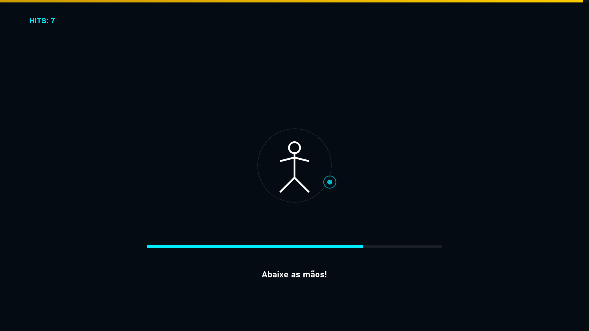 |

| PenLinux: Escudo de Gelo | PenLinux: Notas Musicais |
| --- | --- |
| 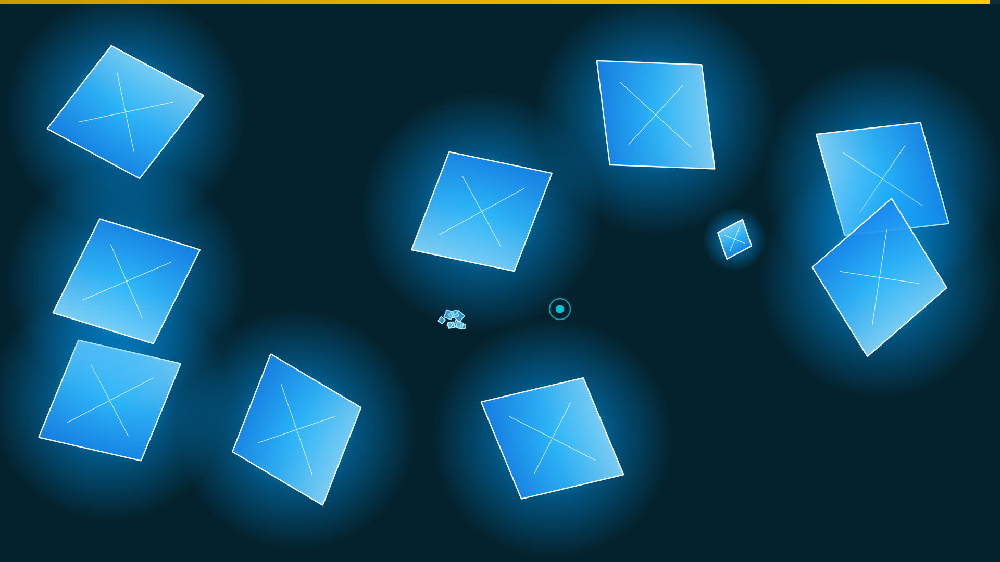 | 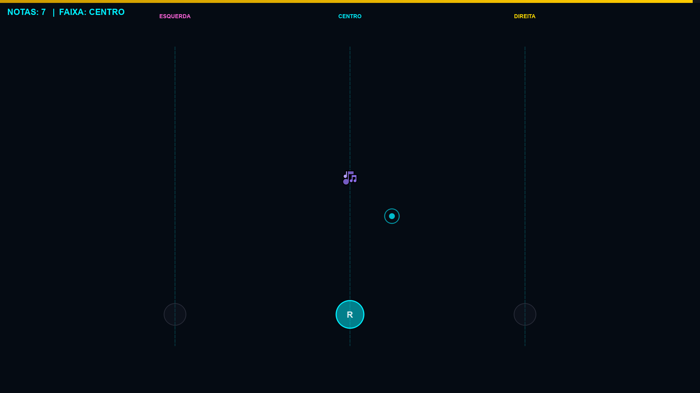 |

| Desvio do ataque do chefe |
| --- |
| 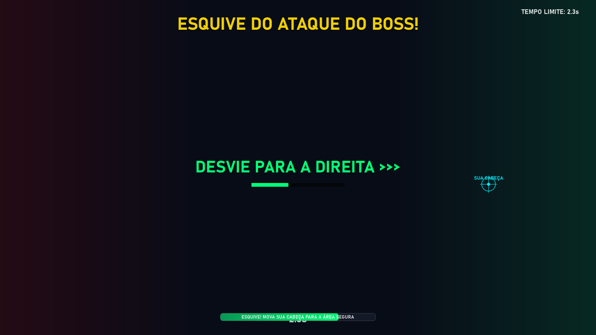 |

Em **Sucção Jurássica**, a captura mostra a instrução; o vórtice e as orbes são renderizados na arena 3D. Em **Meteor Stomp**, a captura mostra o HUD; os meteoros também são renderizados em 3D.

### Ataques de DinoByte

| Ataque | Entrada no jogo | Efeito |
| --- | --- | --- |
| **Mordida Jurássica** | Alinhar as mãos e fechar para morder as presas. | Dano de base: 16. |
| **Sucção Jurássica** | Virar a cabeça para sugar orbes no vórtice 3D. | Dano de base: 18. |
| **Meteor Stomp** | Mover a cabeça entre as posições e coletar meteoros. | Dano de base: 20. |

DinoByte e PenLinux podem ser escolhidos na apresentação por clique ou mantendo a mão sobre o card por 3 segundos. Ao iniciar o jogo isoladamente sem `--robot`, a seleção também aparece na tela. O ataque do turno é sorteado entre os três do personagem, sem repetir até completar o ciclo.

## Arquitetura

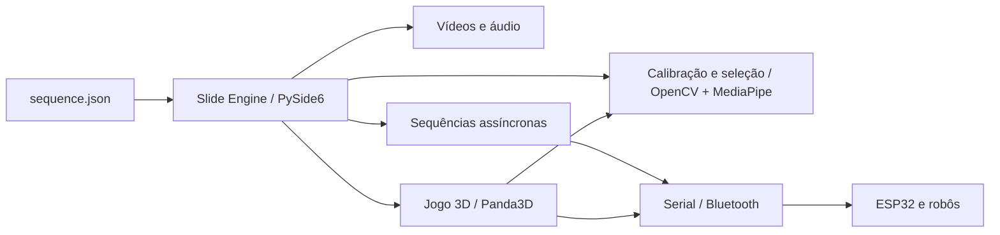

| Parte | Arquivos principais | Papel |
| --- | --- | --- |
| Apresentação | `main.py`, `engine/`, `players/`, `sequence.json` | Exibe slides, controla vídeo e avanço da sequência. |
| Visão computacional | `game/engine/input/cv_input.py`, `players/calibration_player.py`, `players/selection_player.py` | Lê câmera, calibra mão e oferece entrada por gestos. |
| Batalha | `game/main.py`, `game/engine/`, `game/game/` | Renderiza arena, personagens, HUD e minijogos. |
| Robôs | `robot_sequence.py`, `robot_choose_sequence.py`, `game/game/combat/serial_controller.py` | Envia ações sequenciais por serial e aguarda confirmação. |
| Firmware | `game/MainRobotControl/`, `game/parser/`, `game/BluetoothParser.ino` | Código Arduino para controle e interpretação dos comandos. |

## Executar

### Requisitos

- Windows com Python 3.10 ou superior; os testes abaixo foram feitos com Python 3.14.6.
- Webcam para a interação por visão computacional.
- Git LFS para obter os vídeos, modelos 3D e modelos de visão completos.
- ESP32 e configuração serial apenas para operar com os robôs físicos. O padrão `DEV_MODE = True` permite executar sem porta serial física.

```powershell
git clone https://github.com/NycolasQG-DEV/OBR-Artistica-2026-Batalha-de-Robos.git
cd OBR-Artistica-2026-Batalha-de-Robos
git lfs pull
py -m venv .venv
.\.venv\Scripts\Activate.ps1
python -m pip install -r requirements.txt
python main.py
```

Execute `python main.py` **na raiz do repositório**. Alguns recursos do jogo usam caminhos relativos. A primeira etapa aguarda a câmera e a calibração; sem webcam, o fluxo completo pode não avançar automaticamente.

Para abrir apenas a batalha, execute `python game/main.py` e escolha DinoByte ou PenLinux na tela. Para iniciar diretamente com um personagem, use `python game/main.py --robot DinoByte` ou `python game/main.py --robot PenLinux`.

### Controles da apresentação

| Tecla | Ação |
| --- | --- |
| `F11` ou `F` | Alterna tela cheia. |
| `H` ou `Tab` | Mostra ou oculta barras. |
| `Espaço` | Pausa ou retoma. |
| `←` / `→` | Volta ou avança um slide. |
| `Esc` | Fecha a apresentação. |

### Configuração

Em [`config.py`](config.py), `DEV_MODE = True` ativa a simulação serial. Para o robô físico, configure `DEV_MODE = False`, `SERIAL_PORT`, velocidade e tempo limite conforme seu ESP32. Confira também a câmera e o firmware antes da operação física. Os comandos usam confirmação `ok` para controlar a sequência.

Em [`sequence.json`](sequence.json), cada slide define tipo, ordem, fonte e espera. Os vídeos ativos do roteiro são `assets/ATO1-pt1.mp4`, `assets/ATO1-pt2.mp4` e `assets/ATO3.mp4`. Outros arquivos em `assets/` são materiais preservados da produção da apresentação.

## Testes e estado da versão

Em 3 de outubro de 2026, no Windows com Python 3.14.6:

- `python -m compileall -q main.py config.py engine players game robot_choose_sequence.py robot_sequence.py tests` — **passou**.
- `python -m unittest discover -s tests -v` — **4 testes passaram**: referências da sequência, comandos por personagem, seleção de DinoByte e registro dos três ataques.
- Importação dos pontos de entrada `main.py` e `game/main.py` — **passou**.
- Criação da janela PySide6 com plataforma `offscreen` — **passou**, com seis slides carregados.
- Seleção por clique e permanência do cursor no card de DinoByte — **passou**; a escolha foi propagada para o controle da apresentação.
- Jogo 3D inicializado com DinoByte como jogador e PenLinux como adversário — **passou** em modo de simulação serial.
- Os ataques `atk0` (Mordida Jurássica), `atk1` (Sucção Jurássica) e `atk2` (Meteor Stomp) chegaram aos respectivos fluxos — **passou**. A seleção de PenLinux também foi conferida.

O fluxo completo com webcam, reprodução dos vídeos, renderização 3D e comunicação com o ESP32 **não foi validado neste teste automatizado**. As imagens da apresentação mostram uma execução anterior; as prévias dos minijogos são capturas isoladas das interfaces. Nenhuma substitui a validação em hardware. A dependência `PyYAML` estava ausente no ambiente de teste; os testes citados não dependem dela.

As prévias de minijogos foram capturadas por `python scripts/capture_minigames.py` com a plataforma Qt `offscreen`. A geração das sete imagens passou; ela verifica a renderização das interfaces isoladas, sem testar gestos ou movimento dos robôs.

## Recursos e Git LFS

Vídeos `.mp4`, modelos `.glb` e modelos de visão `.task`/`.tflite` usam Git LFS. O arquivo `assets/ATO3.mp4` ultrapassa o limite comum de arquivo Git e exige esse fluxo. Após clonar, execute `git lfs pull` antes de iniciar a apresentação.

## Créditos

Desenvolvido por **Nycolas Queiroz Gimenez** para a OBR Artística 2026. O projeto inclui elementos da equipe Hortobots e os personagens DinoByte e PenLinux.
