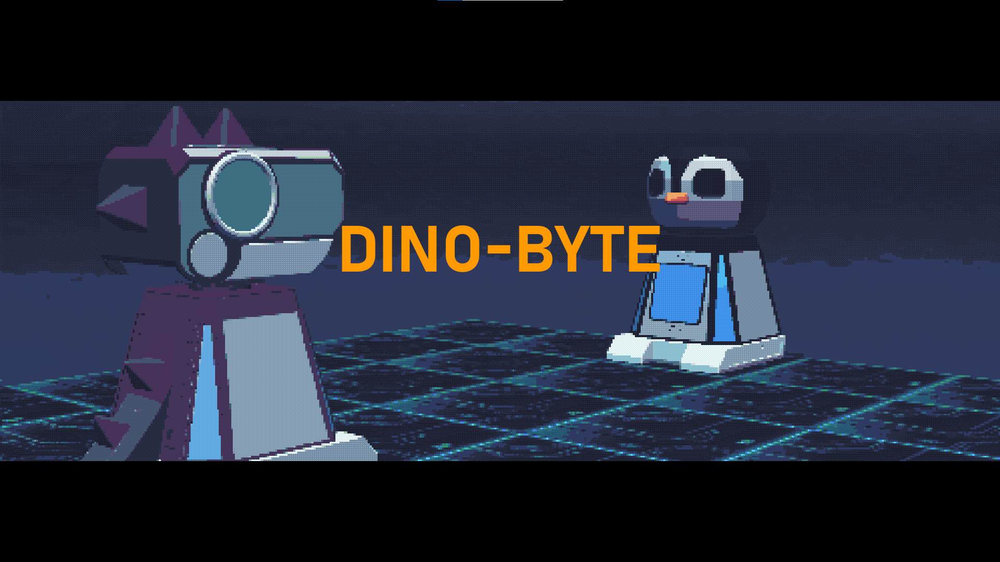
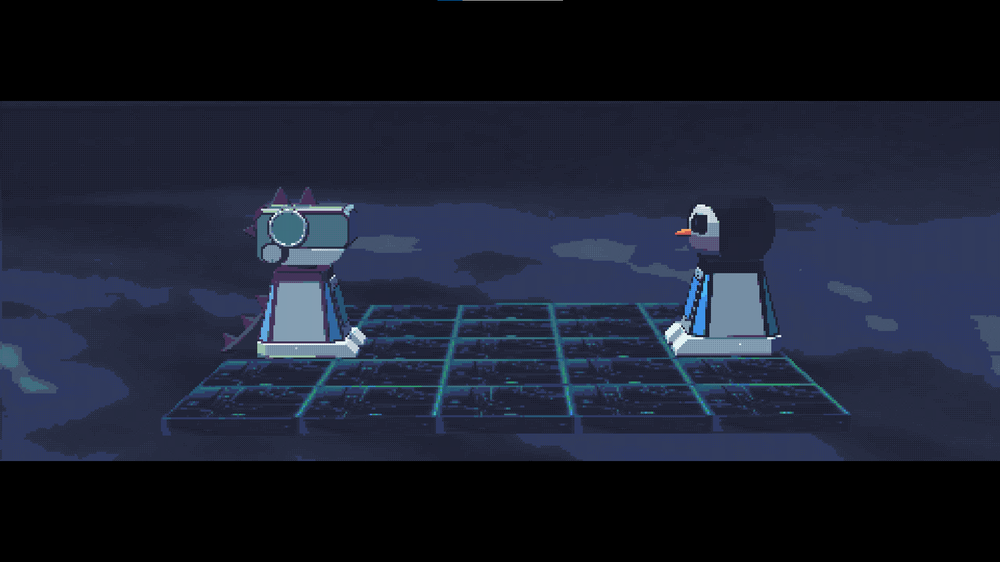
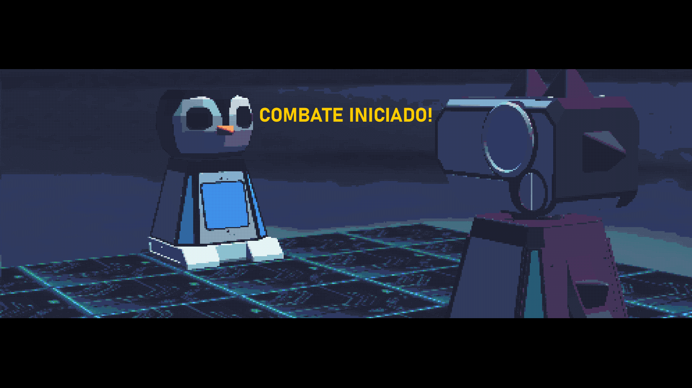
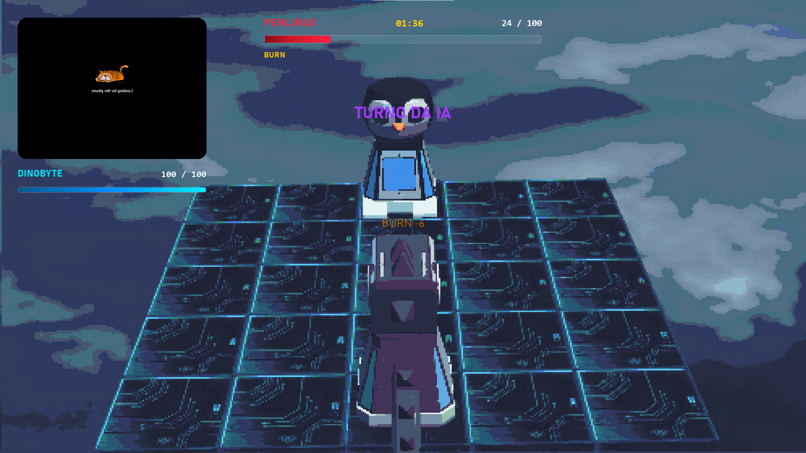
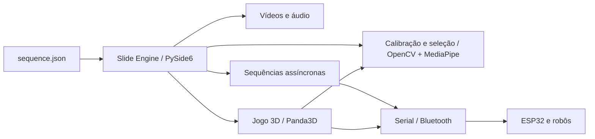

<h1 align="center">DinoByte & PenLinux</h1>

<p align="center"><strong>Apresentação interativa e arena robótica 3D · OBR 2026 · Etapa regional</strong></p>

<p align="center">
  
  
  
  
  
</p>

<p align="center"></p>

Projeto usado na minha apresentação da **Olimpíada Brasileira de Robótica (OBR) em 2026, na etapa regional**. A experiência combina uma apresentação multimídia, interação por câmera, escolha de personagem, comandos para robôs e uma batalha em uma arena 3D. Este repositório preserva o código, os recursos e os registros visuais dessa versão do projeto.

## O que acontece na apresentação

1. A câmera inicia a calibração da mão.
2. O primeiro vídeo apresenta a história; um roteiro de comandos robóticos pode rodar em paralelo.
3. O público escolhe **DinoByte** ou **PenLinux**.
4. Uma sequência assíncrona movimenta o robô selecionado.
5. O vídeo seguinte inicia o jogo 3D em outro processo.
6. Após o jogo, a apresentação retorna ao ato final.

A ordem, os tempos e os tipos de slide ficam em [`sequence.json`](sequence.json). O fluxo usa `asyncio` para coordenar a apresentação, e o jogo combina PySide6 com Panda3D.

## Galeria

| Arena | Início do combate |
| --- | --- |
|  |  |

| Turno da IA | Abertura |
| --- | --- |
|  |  |

Os quatro prints originais de 24 de julho de 2026 estão organizados em [`docs/screenshots/`](docs/screenshots/). Eles registram uma execução anterior; não são capturas produzidas pelos testes automatizados deste repositório.

## Arquitetura



| Parte | Arquivos principais | Papel |
| --- | --- | --- |
| Apresentação | `main.py`, `engine/`, `players/`, `sequence.json` | Exibe slides, controla vídeo e avanço da sequência. |
| Visão computacional | `game/engine/input/cv_input.py`, `players/calibration_player.py`, `players/selection_player.py` | Lê câmera, calibra mão e oferece entrada por gestos. |
| Batalha | `game/main.py`, `game/engine/`, `game/game/` | Renderiza arena, personagens, HUD e minijogos. |
| Robôs | `robot_sequence.py`, `robot_choose_sequence.py`, `game/game/combat/serial_controller.py` | Envia ações sequenciais por serial e aguarda confirmação. |
| Firmware | `game/MainRobotControl/`, `game/parser/`, `game/BluetoothParser.ino` | Código Arduino para controle e interpretação dos comandos. |

## Executar

### Requisitos

- Windows com Python 3.10 ou superior; os testes abaixo foram feitos com Python 3.14.6.
- Webcam para a interação por visão computacional.
- Git LFS para obter os vídeos, modelos 3D e modelos de visão completos.
- ESP32 e configuração serial apenas para operar com os robôs físicos. O padrão `DEV_MODE = True` permite executar sem porta serial física.

```powershell
git clone https://github.com/NycolasQG-DEV/OBR-2026-DinoByte-PenLinux.git
cd OBR-2026-DinoByte-PenLinux
git lfs pull
py -m venv .venv
.\.venv\Scripts\Activate.ps1
python -m pip install -r requirements.txt
python main.py
```

Execute `python main.py` **na raiz do repositório**. Alguns recursos do jogo usam caminhos relativos. A primeira etapa aguarda a câmera e a calibração; sem webcam, o fluxo completo pode não avançar automaticamente.

### Controles da apresentação

| Tecla | Ação |
| --- | --- |
| `F11` ou `F` | Alterna tela cheia. |
| `H` ou `Tab` | Mostra ou oculta barras. |
| `Espaço` | Pausa ou retoma. |
| `←` / `→` | Volta ou avança um slide. |
| `Esc` | Fecha a apresentação. |

### Configuração

Em [`config.py`](config.py), `DEV_MODE = True` ativa a simulação serial. Para o robô físico, configure `DEV_MODE = False`, `SERIAL_PORT`, velocidade e tempo limite conforme seu ESP32. Confira também a câmera e o firmware antes da operação física. Os comandos usam confirmação `ok` para controlar a sequência.

Em [`sequence.json`](sequence.json), cada slide define tipo, ordem, fonte e espera. Os vídeos ativos do roteiro são `assets/ATO1-pt1.mp4`, `assets/ATO1-pt2.mp4` e `assets/ATO3.mp4`. Outros arquivos em `assets/` são materiais preservados da produção da apresentação.

## Testes e estado da versão

Em 3 de outubro de 2026, no Windows com Python 3.14.6:

- `python -m compileall -q main.py config.py engine players game robot_choose_sequence.py robot_sequence.py tests` — **passou**.
- `python -m unittest discover -s tests -v` — **2 testes passaram**: referências da sequência e destino dos comandos de cada personagem.
- Importação dos pontos de entrada `main.py` e `game/main.py` — **passou**.
- Criação da janela PySide6 com plataforma `offscreen` — **passou**, com seis slides carregados.

O fluxo completo com webcam, reprodução dos vídeos, renderização 3D e comunicação com o ESP32 **não foi validado neste teste automatizado**. Os prints acima mostram a interface em execução anterior, sem substituir a validação em hardware. A dependência `PyYAML` estava ausente no ambiente de teste; os testes citados não dependem dela.

## Recursos e Git LFS

Vídeos `.mp4`, modelos `.glb` e modelos de visão `.task`/`.tflite` usam Git LFS. O arquivo `assets/ATO3.mp4` ultrapassa o limite comum de arquivo Git e exige esse fluxo. Após clonar, execute `git lfs pull` antes de iniciar a apresentação.

## Créditos

Desenvolvido por **Nycolas Queiroz Gimenez** para a apresentação da OBR 2026. O projeto inclui elementos da equipe Hortobots e personagens DinoByte e PenLinux. Este repositório documenta a versão regional da apresentação; não afirma premiação ou resultado competitivo.
